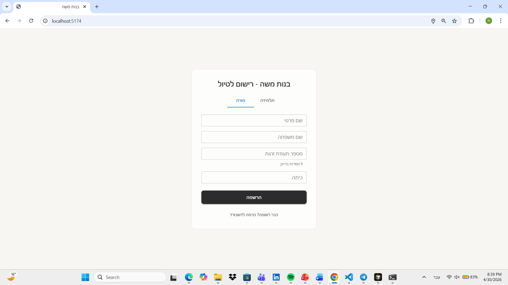
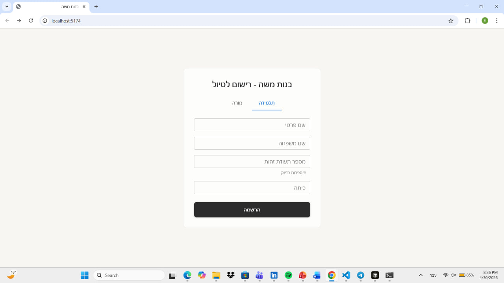
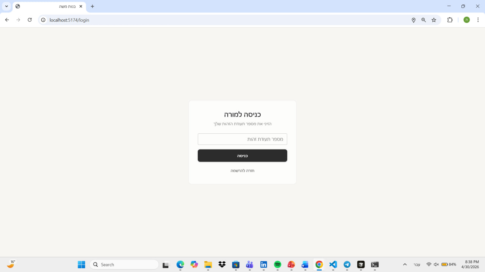
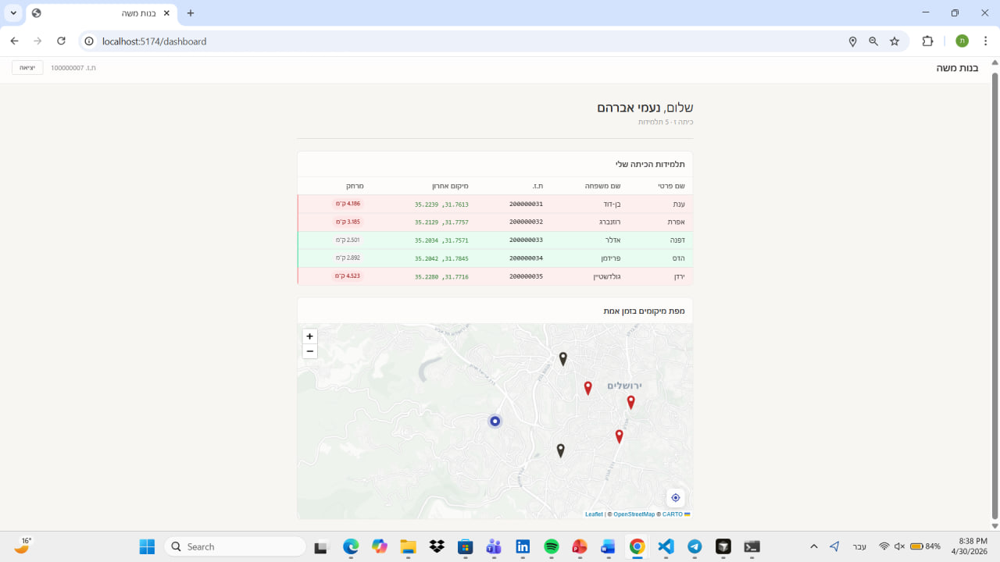

# Field Trip Tracker — School Trip Management System

A full-stack web application for real-time student location monitoring during school field trips,
built for Beit Sefer "Bnot Moshe" in Jerusalem.

---

## Architecture & Tech Stack

| Layer    | Technology                  | Notes                                          |
|----------|-----------------------------|------------------------------------------------|
| Server   | Node.js + Express 5         | REST API + SSE push channel                    |
| Database | SQLite 3 (WAL mode)         | Single-file, zero-config persistence           |
| Client   | React 19 + Vite 8           | SPA, CSR only                                  |
| Map      | Leaflet + react-leaflet     | Tile layer: CARTO Light (no API key required)  |
| UI       | MUI v9 + Emotion            | RTL support via `stylis-plugin-rtl`            |

### Real-Time Communication — SSE over WebSocket

Server-Sent Events were chosen over WebSockets because the data flow is strictly unidirectional:
student devices push location updates, the server fans them out to teacher dashboards.
SSE fits this pattern exactly — no upgrade handshake, no binary framing, and the browser
reconnects automatically on drop.

> **Implementation note:** `EventSource` does not support custom headers in browsers.
> The teacher's ID is therefore passed as a query parameter (`?teacher-id=...`) on the SSE
> endpoint, whereas every other protected route reads it from the `teacher-id` header.
> Additionally, Vite's dev proxy buffers streaming responses, which breaks real-time delivery —
> the SSE connection bypasses the proxy and connects directly to `http://localhost:3000`.

---

## Core Functionality

### Step A — Registration & Roster

- `POST /api/teachers` and `POST /api/students` are intentionally public so records can be
  created before any teacher session exists.
- All read endpoints are protected by `teacherAuth` middleware, which validates the `teacher-id`
  header against the database. The ID number itself serves as the credential, per the assignment
  spec — no password scheme is required.

### Step B — Live Location Map

- Students POST location data to the public `POST /api/tracking` endpoint in DMS
  (Degrees–Minutes–Seconds) format, matching the JSON schema from the assignment spec.
- The server converts DMS → decimal degrees **on write** and stores decimal values.
  This avoids repeated conversion on every read and keeps query results immediately usable.
- The dashboard opens an SSE stream on mount and merges each incoming event into a
  `liveLocations` map keyed by student ID — a targeted O(1) state patch per update,
  not a full list re-render.
- The teacher's own location is tracked via `Geolocation.watchPosition()` and periodically
  POSTed to `POST /api/teacher-location` in DMS format.

---

## Bonus Implementation

### Step C — Proximity Alert System

The 3 km perimeter is enforced using the **Haversine formula**, which calculates great-circle
distance on a sphere. A flat Euclidean approximation introduces meaningful error at this scale
(~31° latitude), making Haversine the correct choice.

Distance is computed in **two places** by design:

1. **Server-side** (`POST /api/tracking`): Calculated immediately when a student's location
   arrives, before the SSE event is broadcast. The `out_of_range` flag and `distance_km` are
   already embedded in the push payload — no extra computation on the client for live updates.

2. **Client-side** (`DashboardPage.jsx`): Recalculated using the teacher's live browser
   coordinates once GPS becomes available. This covers the case where the teacher's location
   hasn't yet propagated to the database when the dashboard first loads, ensuring the proximity
   display is always based on the freshest known position.

**Alert behavior:** the first time a student's `out_of_range` flag becomes `true`, a one-shot
toast notification fires. Subsequent updates for the same student do not re-trigger the alert,
tracked via a `useRef` Set to avoid stale closure issues across re-renders.

### Coordinate Filtering

The map renders only coordinates that fall within a hardcoded Jerusalem bounding box
(`31.70–31.85 °N`, `35.14–35.30 °E`). This is a deliberate data quality guard: coordinates
outside this range — e.g., a device that hasn't acquired a GPS fix and reports `0, 0` — are
silently discarded rather than snapping the map view to an irrelevant location.

---

## Setup & Installation

### Prerequisites

- Node.js ≥ 18
- npm

### 1 — Server

```bash
cd server
npm install
node seed.js    # creates school.db with 8 teachers and 40 students
npm start       # production  |  or: npm run dev  (nodemon, auto-restart)
```

The server listens on port **3000** by default. Set the `PORT` environment variable to override.

**Seed credentials**

| Role    | ID range                    | Example                              |
|---------|-----------------------------|--------------------------------------|
| Teacher | `100000001` – `100000008`   | `100000001` — רחל כהן, class א       |
| Student | `200000001` – `200000040`   | `200000001`                          |

### 2 — Client

```bash
cd client
npm install
npm run dev     # Vite dev server → http://localhost:5173
```

Vite proxies all `/api` requests to `http://localhost:3000`, **except** the SSE stream,
which connects directly to avoid response buffering.

---

### Simulating a Student Location Update

Send a `POST` to `http://localhost:3000/api/tracking`:

```json
{
  "ID": "200000001",
  "Coordinates": {
    "Longitude": { "Degrees": "35", "Minutes": "12", "Seconds": "30" },
    "Latitude":  { "Degrees": "31", "Minutes": "46", "Seconds": "10" }
  },
  "Time": "2024-06-01T10:00:00Z"
}
```

---

## Screenshots

**Teacher Login**



**Student Login**



**Registration**



**Dashboard — Student Roster & Live Map**



> The blue marker indicates the teacher's current location. Student pins turn red when a student is more than 3 km away from the teacher.

---

*Node.js · Express · SQLite · React · Leaflet · MUI*
